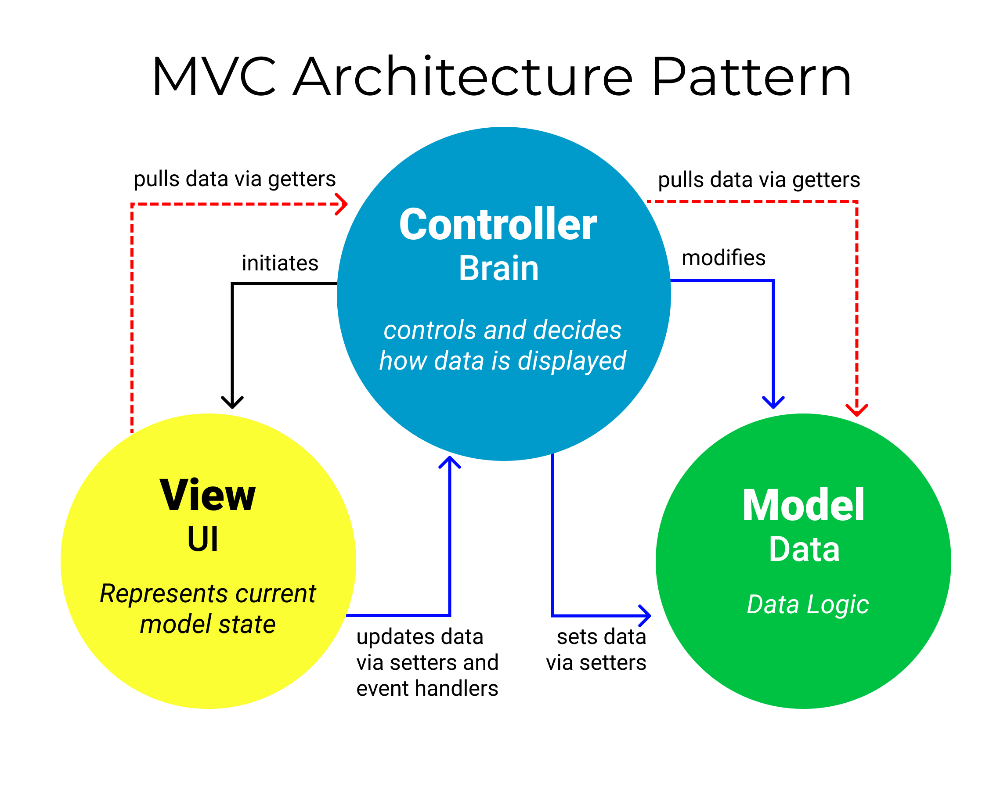

`#php` `#SQL` `#mvc` `#basics` `#master-in-software-engineering`

# MVC Pattern Basics <!-- omit in toc -->

In this pill you will learn to implement one of the most common architecture patterns and you will practice an example following the MVC standards.

## Repository <!-- omit in toc -->

Project created from the Assembler School repository php-mvc-pattern-basics:

https://github.com/assembler-school/php-mvc-pattern-basics.git

## Technologies used <!-- omit in toc -->

\* PHP
\* SQL
\* JavaScript
## Index <!-- omit in toc -->

- [Main objectives](#main-objectives)
- [Investigation](#investigation)

## Main objectives

* Understand what it is an architecture pattern, what it is used for, and what advantages it can bring to the project
* Learn to implement the MVC pattern
* Learn more about the use of this pattern for future implementations in popular Working Frameworks

## Investigation

* What is an architecture pattern?
  A structure that solves a problem and can be repeated to created a whole working method.

* What is the MVC pattern?
  The MVC pattern is based in three main components:
  - Model: the part in charge of managing the data, logic and rules of the structure.
  - View: the frontend part of the project, that shows all the data and information adquired on the model part.
  - Controller: this part reacts to the inputs from the user, selects the corresponding functions of the model and, generally, distributes all the workflow from the structure.
  
  Alltogether allows a well compartmentalised structured that allows a great scalability and understanding of the project.

* Draw a scheme where you understand that the MVC pattern is clearly showcased.
  
  

  \* Image obtained from freecodecamp.org:
  https://www.freecodecamp.org/news/the-model-view-controller-pattern-mvc-architecture-and-frameworks-explained/
  