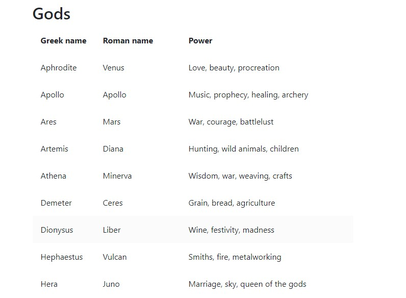
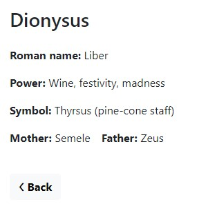

`#php` `#SQL` `#mvc` `#basics` `#master-in-software-engineering`

# MVC Pattern Basics <!-- omit in toc -->

In this pill we will learn to implement one of the most common architecture patterns and we will practice an example following the MVC standards.

## Repository <!-- omit in toc -->

Project created from the Assembler School repository php-mvc-pattern-basics:

https://github.com/assembler-school/php-mvc-pattern-basics.git

## Technologies used <!-- omit in toc -->

\* PHP  
\* SQL  
\* JavaScript
## Index <!-- omit in toc -->

- [Main objectives](#main-objectives)
- [Investigation](#investigation)
  - [* __What is an architecture pattern?__](#-what-is-an-architecture-pattern)
  - [* __What is the MVC pattern?__](#-what-is-the-mvc-pattern)
  - [* __Draw a scheme where you understand that the MVC pattern is clearly showcased.__](#-draw-a-scheme-where-you-understand-that-the-mvc-pattern-is-clearly-showcased)
  - [* __Explain in which cases you would use this pattern.__](#-explain-in-which-cases-you-would-use-this-pattern)
  - [* __Describe step by step what happens in this pattern from when you create a Request until a Response is returned (you can give more than one example if you consider it necessary).__](#-describe-step-by-step-what-happens-in-this-pattern-from-when-you-create-a-request-until-a-response-is-returned-you-can-give-more-than-one-example-if-you-consider-it-necessary)
  - [* __What advantages do you think this pattern has to use?__](#-what-advantages-do-you-think-this-pattern-has-to-use)

## Main objectives

* Understand what it is an architecture pattern, what it is used for, and what advantages it can bring to the project
* Learn to implement the MVC pattern
* Learn more about the use of this pattern for future implementations in popular Working Frameworks

## Investigation

### * __What is an architecture pattern?__
  A structure that solves a problem and can be repeated to create a whole working method.

### * __What is the MVC pattern?__
  The MVC pattern is based on three main components:
  - Model: the part in charge of managing the data, logic and rules of the structure.
  - View: the front-end part of the project, that shows all the data and information acquired on the model part.
  - Controller: this part reacts to the inputs from the user, selects the corresponding functions of the model and, generally, distributes all the workflow from the structure.
  
  Altogether allows a well compartmentalised structured that allows a great scalability and understanding of the project.

### * __Draw a scheme where you understand that the MVC pattern is clearly showcased.__
  
  

  \* Image obtained from _freecodecamp.org_:  
  https://www.freecodecamp.org/news/the-model-view-controller-pattern-mvc-architecture-and-frameworks-explained/
  
### * __Explain in which cases you would use this pattern.__
  MVC pattern can have a broad use in all kinds of scenarios, maybe being the more generals (we mean by this the ones that require less specialization and specifications) the most suited for it.
  Also, as we said before, its capacity for a large modularity and scalability make it formidable for a lot of different projects.

### * __Describe step by step what happens in this pattern from when you create a Request until a Response is returned (you can give more than one example if you consider it necessary).__
  We will be centering the case in this project so you can see it and test it on your own.

  
  You are now on the Gods page and want to know more about __Dionysus__, the Greek God of wine and festivities (who wouldn't be interested?!). You click on it and the magic begins:
  - There's an event listener that passes some parameters through its URL and the __Controller__ detects them.
  - Once the Controller recognizes the parameters passed on, it can redirect and use the adequate function from the __Model__.
  - The Model is, then, in charge of obtaining the __Dionysus__ information from the database and return it to the Controller.
  - The Controller gets this data and call the corresponding __View__ that will show it (in this case and isolated view of all the characteristics of the God).
  

### * __What advantages do you think this pattern has to use?__
  - It can really adapt to all kinds of projects.
  - Being modularized as it is, can isolate the problems and changes that might be made.
  - A huge scalability as it treats every part of the process on its own.
  - Can be used with any existing programming language (or almost).

## Author <!-- omit in toc -->
Jordi Arnau Esteban - [Jordi Arnau](https://github.com/JordixArnau)